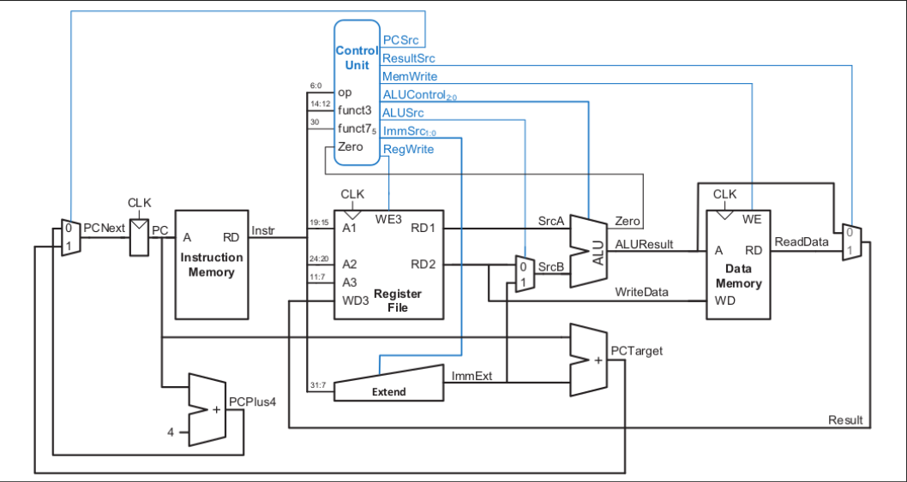

# Custom 32-bit RISC-V SoC with Memory-Mapped SPI

## Overview
This repository contains the RTL design, testbenches, and software integration for a custom System-on-Chip (SoC). It merges a [32-bit Single-Cycle RISC-V microprocessor core](https://github.com/loonamanik/RISC-V-32bit-Single-Cycle) with a custom [Serial Peripheral Interface (SPI) Master module](https://github.com/loonamanik/SPI_master_slave). 

The core feature of this project is the **Memory-Mapped I/O (MMIO)** architecture, allowing the RISC-V CPU to configure, trigger, and read from the hardware SPI peripheral using standard load (`lw`) and store (`sw`) instructions without requiring dedicated I/O pins.

## System Architecture
The CPU is based on a standard 32-bit single-cycle RISC-V datapath. 



The SPI peripheral is mapped directly into the CPU's data memory address space. Address decoding logic intercepts memory operations targeting the SPI base address and routes them to the hardware peripheral instead of standard RAM.

### Memory Map
| Register Name | Memory Address | Access | Description |
| :--- | :--- | :--- | :--- |
| **SPI_CTRL** | `0x40` | R/W | **Bit 0:** Write `1` to start transaction. Read to poll `w_TX_Ready` status (1 = Busy, 0 = Ready). |
| **SPI_DATA** | `0x48` | R/W | **Write:** Sets the 8-bit TX data to broadcast. **Read:** Retrieves the valid 8-bit RX data. |

## Software Synchronization & Polling
Because this core currently operates without a hardware interrupt controller, CPU-to-Peripheral synchronization is handled via a software polling loop. 

To prevent the CPU from outpacing the hardware state machine during startup, "dummy" load instructions are inserted to absorb the 1-2 clock cycle hardware initialization delay. Once the hardware registers the start command, the CPU enters a busy-wait loop, actively polling the `SPI_CTRL` register until the transaction completes.

```assembly
# Base Address Setup
addi x1, x0, 0x40      # 0x00: Load Base Address (0x40) into x1
addi x2, x0, 0xAA      # 0x04: Load TX Data (0xAA) into x2
sw   x2, 8(x1)         # 0x08: Write 0xAA to SPI_DATA (0x48)

# Trigger SPI Transaction
addi x3, x0, 1         # 0x0C: Load Start flag (1) into x3
sw   x3, 0(x1)         # 0x10: Write 1 to SPI_CTRL (0x40)

# Hardware Synchronization Delay (Dummy Reads)
lw   x5, 0(x1)         # 0x14: Dummy Read 1 (Burns 1 cycle)
lw   x5, 0(x1)         # 0x18: Dummy Read 2 (Burns 1 cycle)

# Polling Loop
lw   x5, 0(x1)         # 0x1C: Read SPI_CTRL status into x5
andi x5, x5, 1         # 0x20: Isolate Ready bit (bit 0)
beq  x5, x0, -8        # 0x24: If x5 is 0 (Busy), jump back to 0x1C

# Retrieve Data & Halt
lw   x4, 8(x1)         # 0x28: Hardware is ready! Read RX data into x4
beq  x0, x0, 0         # 0x2C: Infinite halt loop